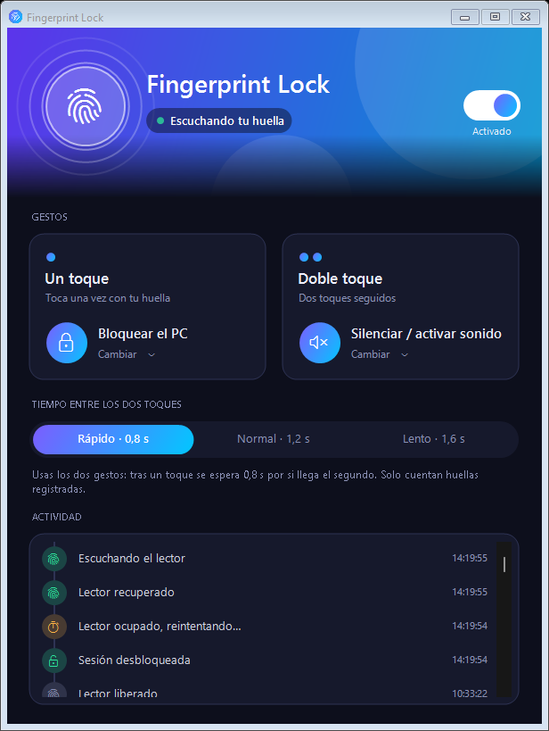

# Fingerprint Lock

Convierte el lector de huellas de tu portátil con Windows en un botón con gestos. Con la sesión desbloqueada, toca el lector con una huella registrada y se ejecuta la acción que elijas.



| Gesto | Ejemplo de uso |
|---|---|
| **Un toque** | Reproducir / pausar la música |
| **Doble toque** | Bloquear el PC al levantarte |

**Acciones disponibles:**
- Bloquear el PC
- Suspender
- Apagar la pantalla
- Reproducir / pausar
- Siguiente pista / pista anterior
- Subir volumen / bajar volumen
- Silenciar / activar sonido

## Descarga e instalación

**Requisitos:**
- Windows 10 u 11 (64 bits).
- Un lector de huellas configurado en **Windows Hello**, con al menos una huella registrada.
- Una cuenta de administrador para instalar.

### Desde la release (recomendado)

1. Descarga `FingerprintLock-v1.0.0.zip` desde [Releases](https://github.com/M4teoM/FingerprintLock/releases/latest) y descomprímelo.
2. Abre **PowerShell como administrador** (clic derecho → *Ejecutar como administrador*) y ejecuta:
   ```powershell
   powershell -NoProfile -ExecutionPolicy Bypass -File "RUTA\FingerprintLock-v1.0.0\install.ps1"
   ```
3. Abre **Fingerprint Lock** desde el menú Inicio.

Si quieres verificar la descarga, compara su suma SHA-256 con `SHA256SUMS.txt` de la release:

```powershell
Get-FileHash .\FingerprintLock-v1.0.0.zip -Algorithm SHA256
```

### Desde el código

No hace falta instalar nada extra: el instalador compila con el compilador de C# que trae Windows (.NET Framework 4).

```powershell
git clone https://github.com/M4teoM/FingerprintLock.git
powershell -NoProfile -ExecutionPolicy Bypass -File .\FingerprintLock\install.ps1
```

### Qué hace el instalador

- Copia los programas a `C:\Program Files\FingerprintLock`.
- Registra y arranca el servicio **Fingerprint Lock**: se inicia con Windows y se reinicia solo si falla.
- Crea los ajustes en `C:\ProgramData\FingerprintLock\config.ini`. Por defecto, el doble toque bloquea el PC y el toque simple no hace nada.
- Hace que la app de la bandeja se abra al iniciar sesión, en todas las cuentas, y añade un acceso directo en el menú Inicio.

Para **actualizar**, ejecuta el instalador de la versión nueva: se conservan tus ajustes.

## Uso

- **Elegir acciones:** haz clic en la tarjeta *Un toque* o *Doble toque* y elige qué hace cada gesto.
- **Tiempo entre toques:** el máximo entre los dos toques de un doble toque (0,8 / 1,2 / 1,6 s).
- **Interruptor:** activa o desactiva la función. Desactivada, el lector vuelve a quedar libre para Windows Hello. También puedes hacerlo desde el menú del icono junto al reloj.
- **Estado:** la cabecera indica si está *Escuchando tu huella*, *Esperando el lector*, *Desactivado* o *Servicio detenido*.
- **Actividad:** muestra cada gesto detectado y la acción que se ejecutó.

Solo cuentan las **huellas registradas** en Windows Hello: los roces y los dedos no registrados se ignoran. Durante los 3 s siguientes a desbloquear también se ignoran los toques, para que entrar con la huella no dispare una acción.

## Limitaciones

- **No hay toque mantenido.** El lector captura una vez al apoyar el dedo y no avisa cuándo lo levantas, así que un toque largo es igual que uno corto.
- **La huella no sirve para otras cosas con la sesión abierta.** Mientras escucha, el servicio tiene el lector reservado, así que los avisos de Windows Hello (UAC, passkeys, gestores de contraseñas) no lo reciben. Usa el PIN o el reconocimiento facial, o desactiva la función con el interruptor.
- **El toque simple puede esperar.** Si asignas acciones a los dos gestos, el toque simple espera el tiempo configurado por si llega un segundo toque.
- **Los ejecutables no están firmados.** Windows SmartScreen o el antivirus pueden avisar la primera vez.

## Solución de problemas

| Síntoma | Qué hacer |
|---|---|
| El estado dice *Servicio detenido* | En PowerShell como administrador: `Start-Service FingerprintLock` |
| Se queda en *Esperando el lector* | Otro programa o un aviso de Windows Hello tiene el lector. Ciérralo; el servicio reintenta solo |
| No pasa nada al tocar | Comprueba que el estado sea *Escuchando tu huella*, que el dedo esté registrado en Windows Hello y que el gesto tenga una acción asignada |
| *No se pudieron guardar los ajustes* | Vuelve a ejecutar `install.ps1`, que reasigna los permisos de `config.ini` |
| Necesito ver qué pasó | El registro completo está en `C:\ProgramData\FingerprintLock\service.log` |

## Desinstalar

En PowerShell como administrador:

```powershell
powershell -NoProfile -ExecutionPolicy Bypass -File "RUTA\uninstall.ps1"
```

Detiene y borra el servicio, la app, el acceso directo, el inicio automático, los ajustes y el registro.

## Documentación técnica

- [Arquitectura y funcionamiento interno](docs/ARQUITECTURA.md)
- [Registro de cambios](CHANGELOG.md)

| Archivo | Contenido |
|---|---|
| `Service.cs` | Servicio: lector, sesiones, gestos y lanzamiento de acciones |
| `App.cs` | App de bandeja y ejecución de acciones (`--action`) |
| `Ui.cs` | Interfaz: tema oscuro, tarjetas, línea de tiempo |
| `Common.cs` | Acciones, archivo de ajustes y versión |
| `build.ps1` / `install.ps1` / `uninstall.ps1` | Compilar, instalar y desinstalar |

## Licencia

[MIT](LICENSE)
